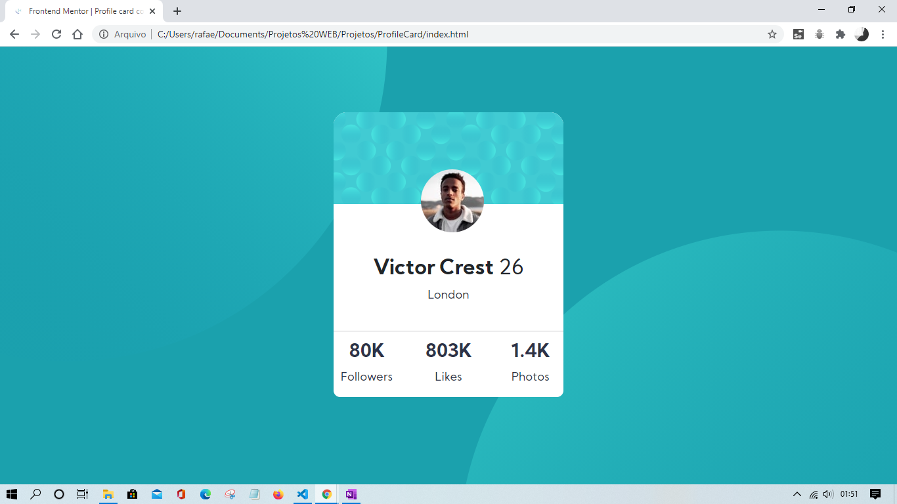

# Frontend Mentor - Profile card component solution

This is a solution to the [Profile card component challenge on Frontend Mentor](https://www.frontendmentor.io/challenges/profile-card-component-cfArpWshJ). Frontend Mentor challenges help you improve your coding skills by building realistic projects. 

## Table of contents

- [Overview](#overview)
  - [The challenge](#the-challenge)
  - [Screenshot](#screenshot)
  - [Links](#links)
- [My process](#my-process)
  - [Built with](#built-with)
  - [Useful resources](#useful-resources)
- [Author](#author)
- [Acknowledgments](#acknowledgments)

**Note: Delete this note and update the table of contents based on what sections you keep.**

## Overview

### The challenge

- Build out the project to the designs provided

### Screenshot

### Links

- Solution URL: [Add solution URL here](https://your-solution-url.com)
- Live Site URL: [Add live site URL here](https://your-live-site-url.com)

### Built with

- Semantic HTML5 markup
- CSS custom properties
- Mobile-first workflow
- Bootstrap 5

### Useful resources

- [DevDocs](https://devdocs.io/) - This helped me for being easy to navigate and finding information.. I really liked this pattern and will use it going forward.
- [Controlling background-images | CSS Tutorial](https://www.youtube.com/watch?v=3T_Jy1CqH9k&t=766s) - This is a good overview video about background-images with good explaining that helped in the images implementation.

## Author

Developed by Rafael Nicola.
- Website - [Add your name here](https://www.your-site.com)
- Frontend Mentor - [@rafanicola](https://www.frontendmentor.io/profile/rafanicola)

